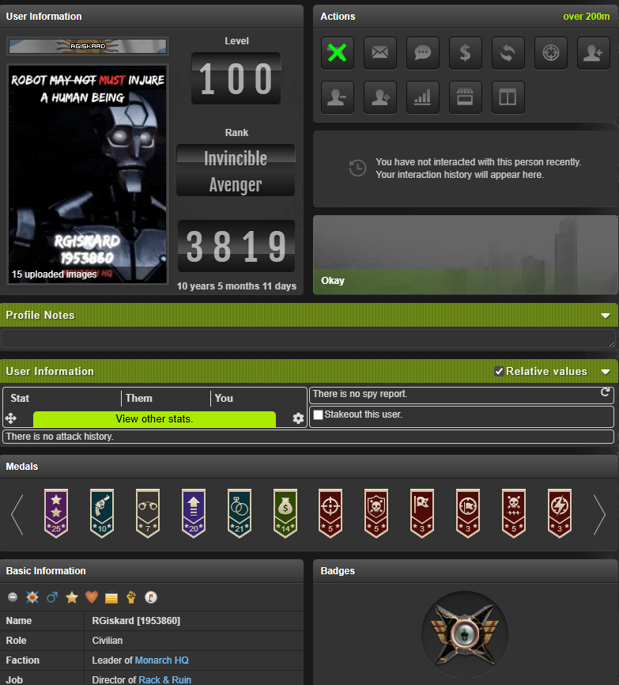
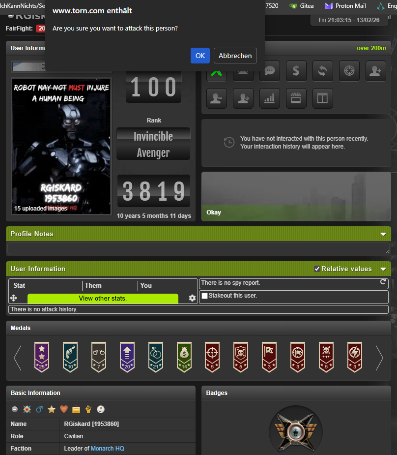
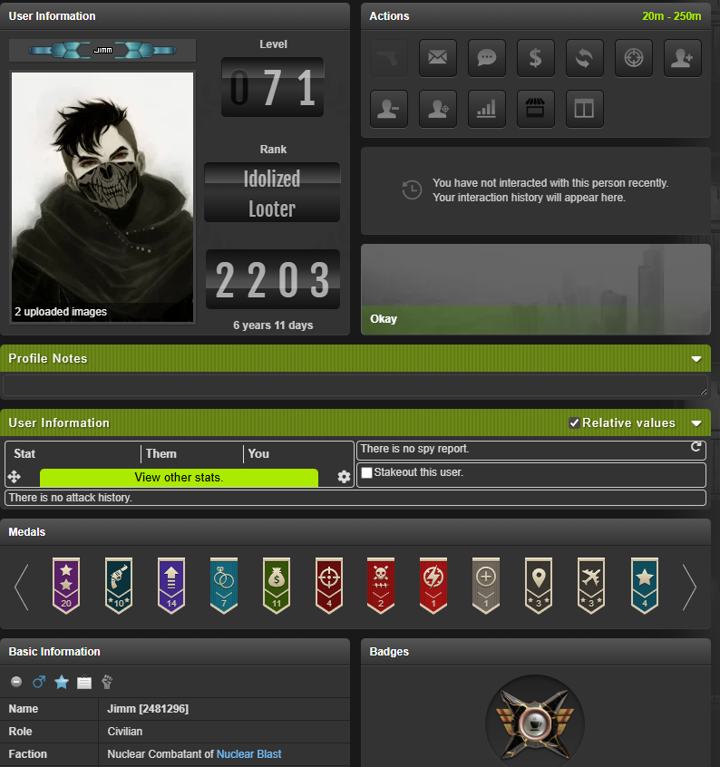

# Monarch Leviathan Faction War Attack Script

A Tampermonkey/Greasemonkey userscript that:

* **Locks** the attack button on every profile page.
* **Unlocks** it only when the target faction is *not* on the “non‑attackable” list.
* Shows a **green X overlay** for factions whose `Reason` is **“Family Faction”** – the button stays clickable and a confirmation popup is shown before the real attack is executed.
* Stores **Family Faction IDs** separately from the normal blacklist so the UI stays consistent across page reloads.

---  

## Table of Contents

1. [Features](#features)
2. [Installation](#installation)
3. [Configuration](#configuration)
4. [How it Works](#how-it-works)
5. [Screenshots](#screenshots)
6. [FAQ](#faq)
7. [License](#license)

---  

## Features

| ✅ | Description |
|---|-------------|
| **Hard‑lock** | The attack button is greyed out and disabled by default. |
| **Family Faction overlay** | When the API returns `Reason: "Family Faction"` the button gets a green X overlay, stays active, and prompts the user before attacking. |
| **Persistent storage** | Two separate `localStorage` keys:  • `warattack_blacklist_cache` – normal blacklist (no Family entries)  • `warattack_family_faction_store` – only Family Faction IDs (kept forever). |
| **Automatic refresh** | Every 10 seconds the script re‑queries the API to keep the cache fresh. |
| **Self‑contained** | No external dependencies besides the Torn API endpoint. |

---  

## Installation

1. Install a userscript manager (Tampermonkey, Greasemonkey, Violentmonkey, etc.).
2. Open the script source file `Monarch_Leviathan_FaktionWarAttackScript.user.js` (or copy the code from the **Code** section below).
3. Click **Install** in the userscript manager dialog.
4. Navigate to any Torn profile page (`https://www.torn.com/profiles.php?...`). The script runs automatically at **document‑start**.

> **Tip:** If you edit the script later, make sure to **save** and **reload** the page (Ctrl + R) to pick up the changes.

---  

## Configuration

| Constant | Meaning | Default |
|----------|---------|---------|
| `TORN_FACTION_ID` | Your own faction ID (used for the API query). | `'40518'` |
| `ATTACKABLE_URL` | Endpoint that returns the list of non‑attackable factions. | `https://outside-avril-hobbyprojectme-914f8088.koyeb.app/api/factions/non-attackable` |
| `KEY_STORAGE` | `localStorage` key where your Torn API key is saved. | `'warattack_torn_api_key'` |
| `CACHE_STORAGE` | Persistent cache for **normal** blacklist entries. | `'warattack_blacklist_cache'` |
| `FAMILY_STORE` | Persistent store for **Family Faction** IDs. | `'warattack_family_faction_store'` |
| `CHECK_INTERVAL_MS` | How often (ms) the script re‑polls the API. | `10000` (10 s) |

# Adding your API Key

The first time the script runs on a profile page you’ll be prompted:

Please enter your Torn API Key:

Enter a valid Torn API key (read‑only permissions are sufficient).  
The key is stored locally in the browser’s localStorage under the key defined in `CONFIG.KEY_STORAGE` (`warattack_torn_api_key`).

## Managing the stored key

**Action** | **Command (run in the browser console)**
--- | ---
View the stored key | `localStorage.getItem('warattack_torn_api_key')`
Remove the stored key (forces a new prompt) | `localStorage.removeItem('warattack_torn_api_key')`
Replace the key (e.g., after rotating your API token) | `localStorage.setItem('warattack_torn_api_key', '<NEW_KEY>')`

After removing or updating the key, reload the page (`Ctrl + R`) so the script picks up the change and, if necessary, asks for the key again.

## Usage

Navigate to any player profile on Torn ([https://www.torn.com/profiles.php?...](https://www.torn.com/profiles.php?...)).

The script runs automatically:

- If the target faction is not on the non‑attackable list, the attack button appears normal (blue/green, fully clickable).
- If the target faction is on the list with **Reason: "Family Faction"**:
   - A green X overlay appears on the button.
   - The button remains clickable.
   - Clicking it opens a confirmation dialog:
      - **Are you sure you want to attack this person?**
         - **Confirm** → the overlay disappears and the normal attack flow continues.
         - **Cancel** → the overlay stays, no attack is sent.
- If the target faction is on the list with any other reason, the button stays greyed out and unclickable.

The script refreshes the cache every `CHECK_INTERVAL_MS` (default 10 s) to keep the UI up‑to‑date without needing a manual reload.

### Visual Overview

| Family Faction (step 1) | Family Faction (step 2) | Normal Blacklist |
| --- | --- | --- |
|  |  |  |

## Troubleshooting

| Symptom | Likely Cause | Fix |
| --- | --- | --- |
| Button stays grey even for Family Faction | The faction ID isn’t in `warattack_family_faction_store`. | Ensure the API response includes `"Reason":"Family Faction"` for that faction. Reload the page; the script will store the ID after the next successful API call. |
| Confirmation popup never appears | The overlay class isn’t applied (maybe CSS conflict). | Verify that the CSS block at the top of the script loads (open DevTools → Elements → select the button → check its classes). If another extension overwrites the styles, disable that extension or adjust the selector specificity. |
| Images in the README don’t render on GitHub | Files aren’t committed or path is wrong. | Commit the image files to the `assets/` directory and push. Use relative paths exactly as shown (`assets/family1.png`). |
| API key prompt keeps re‑appearing | The key was not saved (e.g., private browsing mode). | Use a regular browsing window, or manually set the key via the console (`localStorage.setItem('warattack_torn_api_key','YOUR_KEY')`). |
| Cache isn’t updating | `CHECK_INTERVAL_MS` set to 0 or network error. | Ensure `CHECK_INTERVAL_MS` is a positive integer (default 10000). Check the console for network errors from the API endpoint. |

## Contributing

Feel free to fork the repository, make improvements, and submit a Pull Request. Typical contributions include:

- Bug fixes (e.g., handling edge‑case API responses).
- UI enhancements (different overlay icons, custom colors).
- Additional configuration options (custom refresh interval via a settings panel).

Please keep the following guidelines in mind:

- Maintain separation of Family Faction IDs and normal blacklist entries.
- Do not hard‑code any API keys or secrets.
- Preserve the MIT license header in the script file.

## Changelog

| Version | Date | Changes |
| --- | --- | --- |
| 2.5.7 | 2026‑02‑13 | Added persistent Family Faction store, fixed CSS !important issue, introduced confirmation popup. |
| 2.5.6 | 2026‑02‑12 | Separated Family Faction IDs from blacklist cache, improved UI handling. |
| 2.5.5 | 2026‑02‑10 | Made blacklist cache permanent, removed unnecessary cache clearing. |
| 2.5.4 | 2026‑02‑08 | Fixed button activation for Family Faction, added detailed comments. |
| 2.5.3 | 2026‑02‑05 | Introduced separate CSS class for Family Faction overlay. |
| 2.5.2 | 2026‑02‑03 | First version with green X overlay and confirmation dialog. |